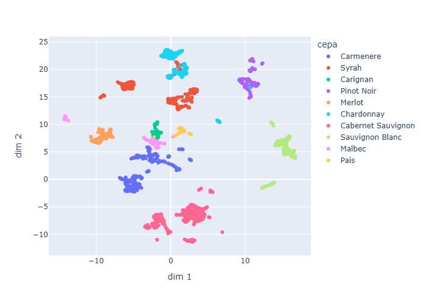

# Wine Recommender

Proyecto de clasificación y recomendación de vinos basado en texto y metadata.

## Objective
Build a system to classify wines and recommend similar products using text descriptions and structured features.

## Data
Wine descriptions and metadata in Spanish, collected from cav.cl.

## Structure
- data/raw: original data
- notebooks: exploration and experiments
- src: reusable code

## How to run
To be defined.

## Results 

[Visualización interactiva](reports/umap_wines.html)